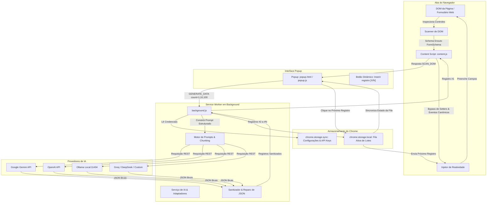

# FormGen — Preenchedor de Formulários com IA & Gerador de Dados Sintéticos

[](manifest.json)
[](tsconfig.json)
[-success?logo=vitest&logoColor=white)](package.json)
[-success?logo=googlechrome&logoColor=white)](tests/e2e/test-runner.mjs)
[](package.json)

O **FormGen** é uma extensão de alto desempenho para o Google Chrome (Manifest V3) que inspeciona formulários web em tempo de execução, gera dados sintéticos realistas e contextualizados utilizando IA multi-provedor (Google Gemini, OpenAI, Ollama ou APIs compatíveis com OpenAI) e preenche automaticamente os campos garantindo reatividade total em Single Page Applications (SPAs em React, Vue, Angular, Svelte e formulários tradicionais).

O FormGen suporta tanto o preenchimento instantâneo de um único registro quanto a geração de lotes gerenciados em fila persistida no navegador (10 ou 100 registros), com avanço sequencial passo a passo diretamente pelo popup da extensão.

---

## Sumário

- [Recursos Principais](#recursos-principais)
- [Arquitetura & Fluxo de Dados](#arquitetura--fluxo-de-dados)
- [Estrutura do Projeto](#estrutura-do-projeto)
- [Provedores de IA Suportados](#provedores-de-ia-suportados)
- [Pré-requisitos & Instalação](#pré-requisitos--instalação)
- [Guia de Configuração](#guia-de-configuração)
- [Como Usar](#como-usar)
  - [Preenchimento Individual (1 Registro)](#preenchimento-individual-1-registro)
  - [Geração em Lote com Fila (10 ou 100 Registros)](#geração-em-lote-com-fila-10-ou-100-registros)
  - [Menu de Contexto no Botão Direito](#menu-de-contexto-no-botão-direito)
  - [Descartando uma Fila Ativa](#descartando-uma-fila-ativa)
- [Pipeline de Build & Desenvolvimento](#pipeline-de-build--desenvolvimento)
- [Testes & Garantia de Qualidade](#testes--garantia-de-qualidade)
  - [Testes Unitários (Vitest)](#testes-unitários-vitest)
  - [Suite de Testes E2E Automatizada (4 Níveis)](#suite-de-testes-e2e-automatizada-4-níveis)
- [Grafo de Conhecimento (Graphify)](#grafo-de-conhecimento-graphify)
- [Licença & Autoria](#licença--autoria)

---

## Recursos Principais

### 🔍 Scanner de DOM Enxuto & Cascata de Labels em 7 Níveis
- **Extração de Schema Otimizada para Tokens**: Inspeciona os controles do formulário e produz um schema JSON estritamente sanitizado, com **zero HTML bruto, estilos inline, classes CSS ou tags de script**, alcançando **mais de 95% de economia de tokens** nas requisições para os LLMs.
- **Cascata de Resolução de Labels em 7 Níveis**: Identifica com precisão o rótulo legível de cada campo, mesmo em formulários com marcação imperfeita ou semântica deficiente:
  1. Associação explícita `<label for="inputId">`
  2. Elemento `<label>` pai/ancestral envolvente
  3. Atributo `aria-labelledby` referenciando texto de outro nó do DOM
  4. Atributo `aria-label` do próprio elemento
  5. Texto de `placeholder`
  6. Irmão anterior ou texto de contexto próximo / `<legend>`
  7. Fallback heurístico a partir dos atributos `name` ou `id`
- **Extração de Regras de Validação HTML5**: Mapeia restrições nativas (`required`, `min`, `max`, `step`, `pattern`, `minlength`, `maxlength`, `autocomplete`, `inputmode`).
- **Agrupamento e Filtragem Inteligente**: Agrupa botões de opção (*radio buttons*) com o mesmo `name`, extrai opções de elementos `<select>` (simples e múltiplos) e descarta controles não preenchíveis (`type="hidden"`, tokens CSRF, `type="file"`, campos desabilitados, somente leitura e *honeypots* invisíveis fora da tela ou com dimensões zeradas).
- **Estampagem Transitória no DOM**: Marca elementos de forma idempotente com o atributo `data-formgen-id` para permitir injeção determinística sem interferir no comportamento original da página.

### 🤖 Motor de IA Multi-Provedor
- **Provedores Integrados**:
  - **Google Gemini**: Integração oficial com `gemini-1.5-flash`, `gemini-1.5-pro` e `gemini-2.0-flash` via endpoint `generateContent`, autenticação por `x-goog-api-key` e MIME type nativo de resposta em JSON.
  - **OpenAI**: Suporte a GPT-4o mini, GPT-4o e GPT-3.5 Turbo via `/chat/completions` com modo estrito `response_format: { type: "json_object" }`.
  - **Ollama**: Inferência local, privada e sem custo (`llama3`, `mistral`, `phi3`, etc.) via `/api/chat` com parâmetro `format: "json"`.
  - **APIs Compatíveis com OpenAI**: Conexão com Groq (`llama-3.1-8b-instant`), Together AI, DeepSeek, LocalAI e vLLM.
- **Envelope JSON Estrito**: Obriga o modelo a responder estritamente dentro da estrutura `{ "records": [ ... ] }`, mapeando as chaves para os identificadores dos campos.
- **Motor de Fragmentação (Chunking) para Lotes**: Divide requisições grandes de 100 registros em lotes sequenciais menores (ex.: blocos de 20) para evitar estouro do teto de tokens de saída (*token truncation*) e timeouts.
- **Sanitização e Recuperação Resiliente de JSON**: Remove marcações markdown (````json ... ````), isola delimitações JSON válidas, corrige vírgulas sobressalentes (*trailing commas*), recupera respostas truncadas e aplica valores padrão heurísticos para campos opcionais não retornados pelo modelo.

### 📋 Gerenciamento de Fila no Navegador & Avanço Dinâmico
- **Injeção Imediata do Primeiro Registro**: Ao solicitar um lote (10 ou 100 registros), o Registro #1 é inserido imediatamente no formulário da página ativa, enquanto os registros subsequentes (#2 a #N) são persistidos em `chrome.storage.local`.
- **Botão com Estado Dinâmico**: A interface do popup reflete o ciclo de vida da fila em tempo real:
  - Estado ocioso: `Gerar dados`
  - Fila ativa: `Inserir registro [2/10]`, `Inserir registro [3/10]`, etc.
- **Isolamento de Escopo por URL e Formulário**: As filas de dados ficam estritamente atreladas à URL da aba ativa e ao identificador do formulário, evitando sobreposição de dados entre abas ou formulários distintos.
- **Ciclo de Vida Automatizado**: A fila é removida automaticamente da memória ao concluir o último registro. O usuário também pode acionar a qualquer momento a opção "Descartar fila".

### ⚡ Injeção no DOM Agnóstica a Frameworks & Reatividade
- **Bypass de Setters Nativos**: Contorna as barreiras de estados controlados do React 16 a 19, Vue, Angular e Svelte invocando diretamente os descritores de propriedades nativas (`HTMLInputElement.prototype.value.set.call(el, val)`) e resetando os rastreadores internos de valor (`_valueTracker`).
- **Disparo Canônico de Eventos**: Simula com fidelidade o ciclo de interação humana disparando eventos com propagação (*bubbling* e *composed*): `focus` → atribuição do valor via setter → `input` → `change` → `blur`.
- **Compatibilidade Ampla de Controles**: Manipula `text`, `email`, `number`, `tel`, `date`, seletores `<select>` simples e múltiplos, botões de rádio, caixas de seleção (*checkboxes*) e `<textarea>` multilinhas (preservando quebras de linha `\n`).

### 🖱️ Menu de Contexto no Botão Direito & Notificações na Página
- **Acesso Rápido com o Botão Direito**: Clique com o botão direito em qualquer formulário ou campo de input para abrir o submenu nativo do FormGen:
  - **Criar registros ▶**:
    - `1 registro (preencher agora)`: Inspeciona e preenche imediatamente o formulário clicado.
    - `Lote com 10 registros`: Gera 10 registros, insere o #1 e armazena os 9 restantes na fila.
    - `Lote com 100 registros`: Gera 100 registros com particionamento em lotes.
  - **Inserir próximo registro da fila**: Avança a fila ativa e preenche o próximo registro no formulário.
  - **Descartar fila ativa**: Remove a fila atual do armazenamento do navegador.
- **Notificações Flutuantes (Toasts)**: Feedback visual discreto e animado exibido diretamente na página web para acompanhar o status da geração e injeção sem precisar abrir o popup.

---

## Arquitetura & Fluxo de Dados



---

## Estrutura do Projeto

```
/home/JoaoVictor/projetos/FormGen/
├── manifest.json              # Configuração da extensão em Chrome Manifest V3
├── package.json               # Dependências, scripts e metadados do projeto
├── tsconfig.json              # Configurações do compilador TypeScript
├── build.js                   # Pipeline de bundling de alta velocidade com esbuild
├── dist/                      # Pacote compilado pronto para execução no Chrome
│   ├── background.js          # Bundle do background service worker
│   ├── content.js             # Bundle do content script
│   ├── popup.html / .js / .css# Interface e script do popup
│   ├── options.html / .js / .css# Página de opções e configurações
│   └── icons/                 # Ícones gerados da extensão (16px, 48px, 128px)
├── src/
│   ├── background/            # Background service worker e roteamento
│   │   └── index.ts
│   ├── content/               # Módulos injetados na página web
│   │   ├── index.ts           # Ouvintes de mensagens e coordenação
│   │   ├── scanner.ts         # Inspeção do DOM e cascata de labels em 7 níveis
│   │   └── filler.ts          # Bypass de protótipos e disparo de eventos sintéticos
│   ├── popup/                 # Interface do usuário e controle de filas
│   │   ├── popup.html
│   │   ├── popup.ts
│   │   └── popup.css
│   ├── options/               # Painel de preferências do usuário
│   │   ├── options.html
│   │   ├── options.ts
│   │   └── options.css
│   └── shared/                # Tipagens, constantes e integrações com IA
│       ├── types.ts           # Contratos TypeScript (schemas, mensagens, filas)
│       ├── constants.ts       # Constantes padrão, endpoints, limites e strings de UI
│       ├── storage.ts         # Wrapper de storage do Chrome com controle de mutex
│       └── ai/
│           ├── index.ts       # Ponto de entrada do serviço de IA
│           ├── types.ts       # Interfaces dos adaptadores de IA
│           ├── adapters.ts    # Adaptadores Gemini, OpenAI, Ollama e Custom
│           ├── prompt.ts      # Construtor de prompts estruturados com suporte a locale
│           ├── repair.ts      # Sanitizador e reparador de JSON tolerante a falhas
│           ├── heuristics.ts  # Geração heurística de campos faltantes
│           └── service.ts     # Orquestrador de chamadas à IA e fragmentação em lotes
├── tests/
│   ├── fixtures/
│   │   └── test-fixture.html  # Fixture HTML5 independente com simulador de reatividade
│   ├── unit/                  # Suites de testes unitários Vitest (208 testes passando)
│   │   ├── scanner.test.ts
│   │   ├── adversarial_scanner.test.ts
│   │   ├── filler.test.ts
│   │   ├── ai_adapters.test.ts
│   │   ├── ai_prompt.test.ts
│   │   ├── ai_repair.test.ts
│   │   ├── queue_manager.test.ts
│   │   ├── storage.test.ts
│   │   ├── options.test.ts
│   │   └── popup.test.ts
│   └── e2e/                   # Suite E2E automatizada em Chrome Headless (69 testes)
│       ├── test-runner.mjs    # Runner via Chrome DevTools Protocol (CDP) e servidor fixture
│       └── specs/
│           ├── tier1_features.spec.mjs    # Nível 1: Cobertura dos requisitos R1–R5
│           ├── tier2_boundaries.spec.mjs  # Nível 2: Casos de borda, honeypots e React
│           ├── tier3_combinations.spec.mjs# Nível 3: Integrações combinadas entre módulos
│           └── tier4_scenarios.spec.mjs   # Nível 4: Cenários do mundo real (ERP, CRM)
└── scripts/
    ├── generate-icons.mjs     # Gerador autônomo de ícones PNG a partir de canvas/SVG
    └── pack.mjs               # Empacotador do zip de distribuição da extensão
```

---

## Provedores de IA Suportados

| Provedor | Endpoint Padrão | Modelo Padrão | Autenticação | Destaques |
| :--- | :--- | :--- | :--- | :--- |
| **Google Gemini** | `https://generativelanguage.googleapis.com` | `gemini-3.5-flash-lite` | Chave de API (`x-goog-api-key`) | Série Gemini 3: `gemini-3.5-flash-lite` (padrão ultra-rápido e econômico), `gemini-3.8-flash` e `gemini-3.5-flash` com suporte nativo a JSON. |
| **OpenAI** | `https://api.openai.com/v1` | `gpt-4o-mini` | Token Bearer | Modelos GPT e linha reasoning (o4-mini, o3-mini) com `response_format: { type: "json_object" }`. |
| **Ollama** | `http://localhost:11434` | `llama3.3` | Nenhuma | Execução local com Llama 3.3, DeepSeek R1 e Qwen 2.5 via `/api/chat`. |
| **Custom / Groq / DeepSeek** | `https://api.groq.com/openai/v1` | `llama-3.3-70b-versatile` | Chave de API | Inferência de altíssima velocidade compatível com Groq, DeepSeek, Together AI e vLLM. |

---

## Pré-requisitos & Instalação

### Pré-requisitos
- **Node.js**: Versão `18.0.0` ou superior (testado na `v26.5.0`)
- **Google Chrome**: Versão 120+ (testado no Chrome Headless 149)
- **npm**: Gerenciador de pacotes incluso com o Node.js

### 1. Clonar o Repositório & Instalar Dependências
```bash
git clone https://github.com/JoaoVictorOAS/gerarForms.git
cd gerarForms
npm install
```

### 2. Compilar a Extensão
```bash
npm run build
```
O comando executa a geração dos ícones e utiliza o `esbuild` para compilar o TypeScript gerando a pasta `dist/` em menos de 100ms.

### 3. Carregar no Google Chrome
1. Abra o Google Chrome e acesse `chrome://extensions/`.
2. Ative o **Modo do desenvolvedor** no canto superior direito.
3. Clique em **Carregar sem compactação** (*Load unpacked*).
4. Selecione a pasta `dist/` localizada dentro do diretório do FormGen.
5. O ícone do **FormGen** estará visível na barra de extensões do Chrome.

---

## Guia de Configuração

Antes de gerar os primeiros dados sintéticos, configure o provedor de IA desejado:

1. Clique com o botão direito no ícone do FormGen e selecione **Opções** (ou clique no ícone de engrenagem ⚙ dentro do popup).
2. Escolha o seu **Provedor de IA Ativo**:
   - **Google Gemini**: Insira sua chave obtida no [Google AI Studio](https://aistudio.google.com/).
   - **OpenAI**: Insira sua chave de API gerada na [Plataforma da OpenAI](https://platform.openai.com/).
   - **Ollama**: Certifique-se de que o daemon local do Ollama esteja ativo (`ollama run llama3`). A URL base padrão é `http://localhost:11434`.
   - **Custom (Groq / Together / DeepSeek)**: Preencha a URL base da API compatível, sua chave de API e o identificador do modelo.
3. Defina os **Padrões de Geração**:
   - **Idioma / Localidade**: Selecione `pt-BR` (Português do Brasil) ou `en-US` (Inglês) para receber dados sintéticos contextualizados (nomes brasileiros, CPF, telefones, endereços, etc.).
   - **Temperatura**: Controle o nível de criatividade versus determinismo (padrão: `0.7`).
4. Clique em **Testar Conexão** para validar a comunicação com o endpoint e a validade da chave de API.
5. Clique em **Salvar Configurações** para gravar as preferências em `chrome.storage.sync`.

---

## Como Usar

### Preenchimento Individual (1 Registro)
1. Abra qualquer página web que contenha um formulário (ex.: onboarding de clientes, checkout, cadastro ERP).
2. Clique no ícone do **FormGen** na barra de ferramentas.
3. O FormGen inspeciona automaticamente o DOM da página ativa e exibe o identificador do formulário e o número de campos detectados.
4. Escolha **1** em *Quantidade de registros*.
5. Clique em **Gerar dados**.
6. A extensão consulta a IA, recebe os dados estruturados e preenche o formulário na página instantaneamente, acionando todos os eventos de validação e reatividade.

### Geração em Lote com Fila (10 ou 100 Registros)
1. No popup do FormGen, selecione **10** ou **100** registros.
2. Clique em **Gerar dados**.
3. O **Registro #1** é imediatamente preenchido no formulário da página ativa.
4. Os registros restantes (#2 a #N) são salvos de forma persistente na fila do navegador.
5. Submeta ou limpe o formulário na página web conforme o seu fluxo de testes.
6. Reabra o popup do FormGen: o botão principal exibirá dinamicamente **`Inserir registro [2/10]`**.
7. Ao clicar no botão, o registro #2 é injetado e o botão avança automaticamente para **`Inserir registro [3/10]`**, repetindo o processo até o esgotamento do lote.

### Menu de Contexto no Botão Direito
Além da interface do popup, você pode controlar o FormGen com agilidade usando o botão direito do mouse diretamente sobre a página:
1. Clique com o botão direito em qualquer campo de entrada ou dentro de um formulário.
2. Posicione o cursor sobre o menu **FormGen**:
   - **Criar registros ▶**:
     - Selecione **`1 registro (preencher agora)`** para gerar e preencher o formulário imediatamente.
     - Selecione **`Lote com 10 registros`** ou **`Lote com 100 registros`** para preencher o primeiro e enfileirar os restantes.
   - Selecione **`Inserir próximo registro da fila`** para avançar e preencher o próximo registro salvo na fila.
   - Selecione **`Descartar fila ativa`** para limpar a fila a qualquer momento.
3. Uma notificação flutuante (*toast*) no canto inferior da página confirma o progresso em tempo real.

### Descartando uma Fila Ativa
- Se desejar cancelar uma fila de lote antes de preencher todos os registros, clique no botão secundário **Descartar fila** no popup. A fila armazenada será purgada e a interface voltará ao estado inicial ocioso.

---

## Pipeline de Build & Desenvolvimento

O FormGen utiliza o `esbuild` para compilação instantânea e empacotamento modular:

```bash
# Compilação de produção (gera a pasta dist/)
npm run build

# Modo observador (watch) para desenvolvimento contínuo
npm run dev

# Checagem estática de tipos com TypeScript
npm run typecheck

# Criação do arquivo .zip final pronto para distribuição
npm run pack
```

---

## Testes & Garantia de Qualidade

O projeto conta com uma infraestrutura abrangente de testes automatizados com **100% de taxa de aprovação**.

### Testes Unitários (Vitest)
Os testes unitários validam o funcionamento isolado de cada componente da extensão (scanner de DOM, detecção de honeypots, adaptadores de IA, construtor de prompts, sanitizador de JSON, máquina de estados da fila e mutex de armazenamento):

```bash
# Executar todos os testes unitários
npm test

# Executar testes unitários com relatório de cobertura
npm run test:coverage

# Executar testes em modo interativo contínuo
npm run test:watch
```
> **Resultado**: 11 arquivos de teste, **208 testes passando com sucesso**, 0 falhas.

### Suite de Testes E2E Automatizada (4 Níveis)
O executor E2E (`tests/e2e/test-runner.mjs`) sobe um servidor HTTP local com a página fixture HTML5 (`tests/fixtures/test-fixture.html`), inicializa o Google Chrome em modo headless via Chrome DevTools Protocol (CDP) e executa validações de ponta a ponta sem qualquer intervenção humana:

```bash
# Executar a suite E2E completa (4 níveis)
node tests/e2e/test-runner.mjs

# Executar níveis específicos
node tests/e2e/test-runner.mjs --tier=1   # Nível 1: Cobertura de Requisitos (30 testes)
node tests/e2e/test-runner.mjs --tier=2   # Nível 2: Casos de Borda e Honeypots (27 testes)
node tests/e2e/test-runner.mjs --tier=3   # Nível 3: Integração Combinada de Módulos (7 testes)
node tests/e2e/test-runner.mjs --tier=4   # Nível 4: Cenários Reais de Aplicação (5 testes)

# Filtrar testes por expressão regular
node tests/e2e/test-runner.mjs --grep="Reactive"
```

| Nível | Escopo | Testes | Status | Duração |
| :--- | :--- | :---: | :---: | :---: |
| **Nível 1** | Cobertura de Recursos (Happy paths dos requisitos R1 a R5) | 30 | **100% Aprovado** | ~0.10s |
| **Nível 2** | Casos de Borda & Honeypots (Armadilhas, limites de taxa, React 19) | 27 | **100% Aprovado** | ~0.32s |
| **Nível 3** | Combinações Cruzadas (Integração ponta a ponta entre módulos) | 7 | **100% Aprovado** | ~0.21s |
| **Nível 4** | Cenários do Mundo Real (Formulários ERP, CRM em lote, SPAs reativas) | 5 | **100% Aprovado** | ~0.07s |
| **TOTAL** | **Suite E2E Automatizada Completa em Chrome Headless** | **69** | **100% Aprovado** | **~0.70s** |

---

## Grafo de Conhecimento (Graphify)

O repositório mantém um grafo de conhecimento indexado pelo **Graphify** no diretório `graphify-out/`:

- Consultar a arquitetura ou relacionamentos da base de código:
  ```bash
  graphify query "Explique a cascata de labels do scanner de DOM"
  ```
- Atualizar o grafo de conhecimento após modificações de código:
  ```bash
  graphify update .
  ```

---

## Licença & Autoria

- **Autor**: JoaoVictorOAS (<playerthejvs@gmail.com>)
- **Repositório**: [JoaoVictorOAS/gerarForms](https://github.com/JoaoVictorOAS/gerarForms)
- **Licença**: [MIT](LICENSE)
