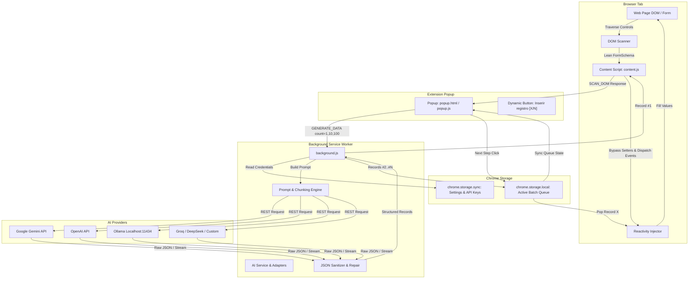

# FormGen — AI Form Filler & Synthetic Data Generator

[](manifest.json)
[](tsconfig.json)
[-success?logo=vitest&logoColor=white)](package.json)
[-success?logo=googlechrome&logoColor=white)](tests/e2e/test-runner.mjs)
[](package.json)

**FormGen** is a high-performance Google Chrome extension (Manifest V3) that inspects web forms in real time, generates realistic, context-aware synthetic data using multi-provider AI (Google Gemini, OpenAI, Ollama, or OpenAI-compatible APIs), and automatically populates form fields with full Single Page Application (SPA) reactivity (React, Vue, Angular, Svelte, and legacy forms).

FormGen supports instant single-record population as well as persistent batch queues (10 or 100 records) with step-by-step queue navigation directly from the browser popup.

---

## Table of Contents

- [Key Features](#key-features)
- [Architecture & Data Flow](#architecture--data-flow)
- [Project Structure](#project-structure)
- [Supported AI Providers](#supported-ai-providers)
- [Prerequisites & Installation](#prerequisites--installation)
- [Configuration Guide](#configuration-guide)
- [How to Use](#how-to-use)
  - [Single Form Filling (1 Record)](#single-form-filling-1-record)
  - [Batch Queue Generation (10 or 100 Records)](#batch-queue-generation-10-or-100-records)
  - [Discarding an Active Queue](#discarding-an-active-queue)
- [Development & Build Pipeline](#development--build-pipeline)
- [Testing & Quality Assurance](#testing--quality-assurance)
  - [Unit Tests (Vitest)](#unit-tests-vitest)
  - [4-Tier Automated E2E Test Suite](#4-tier-automated-e2e-test-suite)
- [Knowledge Graph (Graphify)](#knowledge-graph-graphify)
- [License & Author](#license--author)

---

## Key Features

### 🔍 Lean DOM Scanner & 7-Tier Label Resolution
- **Token-Efficient Schema Extraction**: Inspects form controls and produces an ultra-lean JSON schema with **zero raw HTML, inline styles, CSS classes, or script tags**, achieving **>95% token savings** when sending requests to LLMs.
- **7-Tier Label Resolution Cascade**: Accurately resolves human-readable field labels even on poorly-formed forms using:
  1. Explicit `<label for="inputId">` associations
  2. Enclosing `<label>` ancestor elements
  3. `aria-labelledby` referencing DOM node text
  4. `aria-label` attribute values
  5. `placeholder` text
  6. Preceding sibling or nearby contextual text / legend
  7. Element `name` or `id` fallback heuristics
- **Validation Constraint Extraction**: Extracts HTML5 constraints (`required`, `min`, `max`, `step`, `pattern`, `minlength`, `maxlength`, `autocomplete`, `inputmode`).
- **Control Aggregation & Filtering**: Groups radio buttons by `name`, extracts options from single/multi `<select>` tags, and filters out non-fillable elements (`type="hidden"`, CSRF tokens, `type="file"`, disabled, readonly, and off-screen/zero-dimension honeypots).
- **Transient DOM Stamping**: Tags elements idempotently with `data-formgen-id` attributes for deterministic injection without modifying the host page's functional attributes.

### 🤖 Multi-Provider AI Engine
- **Supported Providers**:
  - **Google Gemini**: Native integration with `gemini-1.5-flash`, `gemini-1.5-pro`, and `gemini-2.0-flash` via `generateContent` using `x-goog-api-key` and native JSON response MIME types.
  - **OpenAI**: GPT-4o mini, GPT-4o, and GPT-3.5 Turbo via `/chat/completions` with strict `response_format: { type: "json_object" }`.
  - **Ollama**: Local, private, zero-cost inference (`llama3`, `mistral`, `phi3`, etc.) via `/api/chat` with `format: "json"`.
  - **Custom OpenAI-Compatible**: Groq (`llama-3.1-8b-instant`), Together AI, DeepSeek, LocalAI, and vLLM endpoints.
- **Strict JSON Contract**: Enforces `{ "records": [ ... ] }` envelope matching extracted form field IDs.
- **Batch Chunking Engine**: Automatically partitions 100-record batch requests into sequential chunks (e.g., chunks of 20) to prevent LLM token ceiling cutoffs and timeouts.
- **Resilient Multi-Tier JSON Repair**: Strips markdown formatting (````json ... ````), extracts valid JSON boundaries, fixes trailing commas, heals truncated responses, and applies heuristic field fallbacks if the LLM omits non-critical fields.

### 📋 In-Browser Persistent Queue & Dynamic Stepping
- **Immediate First Record Injection**: When generating a batch (10 or 100 records), Record #1 is immediately injected into the active form on the page, while records #2..#N are saved to `chrome.storage.local`.
- **Dynamic Stepping Button**: The popup button dynamically updates its state:
  - Idle state: `Gerar dados`
  - Active queue state: `Inserir registro [2/10]`, `Inserir registro [3/10]`, etc.
- **Storage Isolation**: Batches are strictly isolated by active tab URL and form identifier, preventing cross-tab or cross-form data collision.
- **Automatic Lifecycle Management**: Automatically clears storage once the final record is ingested; supports a dedicated "Descartar fila" (Discard Queue) action at any time.

### ⚡ Framework-Agnostic Reactivity & Injection
- **Prototype Setter Trap Bypass**: Bypasses React 16–19, Vue, Angular, and Svelte synthetic event barriers by calling native prototype property setters (`HTMLInputElement.prototype.value.set.call(el, val)`) and invalidating React `_valueTracker` caches.
- **Canonical Event Sequence**: Dispatches bubbling synthetic events in the exact native browser lifecycle: `focus` → value assignment → `input` (bubbles, composed) → `change` (bubbles, composed) → `blur`.
- **Rich Control Support**: Handles `text`, `email`, `number`, `tel`, `date`, single `<select>`, multi `<select>`, radio button groups, checkboxes, and multiline `<textarea>` elements (preserving `\n`).

---

## Architecture & Data Flow



---

## Project Structure

```
/home/JoaoVictor/projetos/FormGen/
├── manifest.json              # Chrome Extension Manifest V3 configuration
├── package.json               # Dependencies, scripts, and extension metadata
├── tsconfig.json              # TypeScript compilation configuration
├── build.js                   # High-speed esbuild bundling pipeline
├── dist/                      # Production-ready extension bundle
│   ├── background.js          # Background service worker bundle
│   ├── content.js             # Content script bundle
│   ├── popup.html / .js / .css# Popup UI bundle
│   ├── options.html / .js / .css# Options page bundle
│   └── icons/                 # Extension icons (16px, 48px, 128px)
├── src/
│   ├── background/            # Background service worker & routing
│   │   └── index.ts
│   ├── content/               # Content script modules
│   │   ├── index.ts           # Message listeners and injection triggers
│   │   ├── scanner.ts         # DOM form scanner and 7-tier label cascade
│   │   └── filler.ts          # Prototype setter bypass and synthetic event dispatcher
│   ├── popup/                 # Popup UI interface & queue stepping
│   │   ├── popup.html
│   │   ├── popup.ts
│   │   └── popup.css
│   ├── options/               # Configuration dashboard
│   │   ├── options.html
│   │   ├── options.ts
│   │   └── options.css
│   └── shared/                # Core types, constants, and AI adapters
│       ├── types.ts           # TypeScript contracts (schemas, messages, queues)
│       ├── constants.ts       # Provider defaults, endpoints, limits, UI strings
│       ├── storage.ts         # Chrome storage wrapper with mutex protection
│       └── ai/
│           ├── index.ts       # AI service entry point
│           ├── types.ts       # AI provider adapter contracts
│           ├── adapters.ts    # Gemini, OpenAI, Ollama, and Custom adapters
│           ├── prompt.ts      # Structured prompt builder with locale support
│           ├── repair.ts      # Resilient JSON extraction and parser
│           ├── heuristics.ts  # Fallback generation for missing fields
│           └── service.ts     # Generation coordinator & chunking logic
├── tests/
│   ├── fixtures/
│   │   └── test-fixture.html  # Comprehensive HTML5 test fixture & reactive simulator
│   ├── unit/                  # Vitest unit test suites (208 passing tests)
│   │   ├── scanner.test.ts
│   │   ├── adversarial_scanner.test.ts
│   │   ├── filler.test.ts
│   │   ├── ai_adapters.test.ts
│   │   ├── ai_prompt.test.ts
│   │   ├── ai_repair.test.ts
│   │   ├── queue_manager.test.ts
│   │   ├── storage.test.ts
│   │   ├── options.test.ts
│   │   └── popup.test.ts
│   └── e2e/                   # 4-Tier automated headless Chrome test suite (69 tests)
│       ├── test-runner.mjs    # Chrome 149 CDP test runner & HTTP fixture server
│       └── specs/
│           ├── tier1_features.spec.mjs    # R1-R5 Happy Path coverage
│           ├── tier2_boundaries.spec.mjs  # Honeypots, limits, React traps
│           ├── tier3_combinations.spec.mjs# Pairwise pipeline integration
│           └── tier4_scenarios.spec.mjs   # Real-world enterprise form workflows
└── scripts/
    ├── generate-icons.mjs     # Standalone SVG-to-PNG canvas icon generator
    └── pack.mjs               # Production zip archive packager
```

---

## Supported AI Providers

| Provider | Endpoint | Default Model | Authentication | Notes |
| :--- | :--- | :--- | :--- | :--- |
| **Google Gemini** | `https://generativelanguage.googleapis.com` | `gemini-1.5-flash` | API Key (`x-goog-api-key`) | Native JSON schema MIME type, ultra-fast generation. |
| **OpenAI** | `https://api.openai.com/v1` | `gpt-4o-mini` | Bearer Token | `response_format: { type: "json_object" }`. |
| **Ollama** | `http://localhost:11434` | `llama3` | None | Local, private, offline execution via `/api/chat`. |
| **Custom / Groq** | `https://api.groq.com/openai/v1` | `llama-3.1-8b-instant` | API Key | Compatible with Groq, Together AI, DeepSeek, and vLLM. |

---

## Prerequisites & Installation

### Prerequisites
- **Node.js**: `v18.0.0` or higher (tested on `v26.5.0`)
- **Google Chrome**: Version 120+ (tested with headless Chrome 149)
- **npm**: Package manager included with Node.js

### 1. Clone & Install
```bash
git clone https://github.com/JoaoVictorOAS/gerarForms.git
cd gerarForms
npm install
```

### 2. Build the Extension
```bash
npm run build
```
This script runs the icon generator and uses `esbuild` to compile TypeScript into the `dist/` directory in under 100ms.

### 3. Load into Google Chrome
1. Open Google Chrome and navigate to `chrome://extensions/`.
2. Enable **Developer mode** in the top right corner.
3. Click **Load unpacked** (Carregar sem compactação).
4. Select the `dist/` directory inside your FormGen project folder.
5. The **FormGen** icon will appear in your Chrome toolbar.

---

## Configuration Guide

Before generating data, configure your preferred AI provider in the FormGen options:

1. Right-click the FormGen extension icon and select **Options** (or click the gear icon ⚙ in the extension popup).
2. Choose your **Active AI Provider**:
   - **Google Gemini**: Enter your Gemini API key from [Google AI Studio](https://aistudio.google.com/).
   - **OpenAI**: Enter your OpenAI API key from the [OpenAI Platform](https://platform.openai.com/).
   - **Ollama**: Ensure your local Ollama daemon is running (`ollama run llama3`). Base URL defaults to `http://localhost:11434`.
   - **Custom (Groq / Together / DeepSeek)**: Enter your endpoint Base URL, API key, and model name.
3. Select your **Data Generation Defaults**:
   - **Locale**: Choose `pt-BR` (Brazilian Portuguese) or `en-US` (English) for localized synthetic data (names, CPF/SSN, phones, addresses).
   - **Temperature**: Adjust creativity vs. determinism (default: `0.7`).
4. Click **Testar Conexão** to verify your endpoint and API key.
5. Click **Salvar Configurações** to persist settings in `chrome.storage.sync`.

---

## How to Use

### Single Form Filling (1 Record)
1. Open any web page containing a form (e.g., CRM, registration page, checkout).
2. Click the **FormGen** icon in your toolbar.
3. FormGen automatically scans the page and displays the detected form name and field count.
4. Select **1** under *Quantidade de registros*.
5. Click **Gerar dados**.
6. FormGen prompts the AI, returns the structured values, and instantly populates the active form, triggering all reactive validation events.

### Batch Queue Generation (10 or 100 Records)
1. In the FormGen popup, select **10** or **100** records.
2. Click **Gerar dados**.
3. **Record #1** is filled into the form immediately.
4. The remaining records (#2 to #N) are saved into the browser queue.
5. Submit or reset the form on your web page.
6. Re-open the popup: the primary button will display **`Inserir registro [2/10]`**.
7. Click the button to inject the next record. The counter automatically advances to **`Inserir registro [3/10]`**, repeating until the entire batch is completed.

### Discarding an Active Queue
- To clear an active queue before completing all records, click **Descartar fila** in the popup. The queue storage will be purged, and the UI will reset to the idle state.

---

## Development & Build Pipeline

FormGen uses `esbuild` for instant compilation and bundling:

```bash
# Production build
npm run build

# Watch mode for live development
npm run dev

# Type check TypeScript codebase
npm run typecheck

# Package the extension into a distributable zip
npm run pack
```

---

## Testing & Quality Assurance

FormGen includes an exhaustive automated verification suite with **100% pass rates across all test suites**.

### Unit Tests (Vitest)
Unit tests cover all core modules in isolation (DOM scanner, honeypot detection, AI adapters, prompt generation, error recovery, queue state machine, and storage mutexes):

```bash
# Run unit tests
npm test

# Run unit tests with code coverage report
npm run test:coverage

# Run unit tests in watch mode
npm run test:watch
```
> **Result**: 11 test files, **208 tests passing**, 0 failing.

### 4-Tier Automated E2E Test Suite
The E2E test runner (`tests/e2e/test-runner.mjs`) starts a local HTTP server serving the standalone HTML5 fixture (`tests/fixtures/test-fixture.html`), launches Google Chrome in headless mode via the Chrome DevTools Protocol (CDP), and executes non-interactive tests against real DOM forms.

```bash
# Execute the complete 4-tier E2E suite
node tests/e2e/test-runner.mjs

# Execute individual tiers
node tests/e2e/test-runner.mjs --tier=1   # Tier 1: Feature Coverage (30 tests)
node tests/e2e/test-runner.mjs --tier=2   # Tier 2: Boundary & Corner Cases (27 tests)
node tests/e2e/test-runner.mjs --tier=3   # Tier 3: Cross-Feature Combinations (7 tests)
node tests/e2e/test-runner.mjs --tier=4   # Tier 4: Real-World Scenarios (5 tests)

# Filter tests by name pattern
node tests/e2e/test-runner.mjs --grep="Reactive"
```

| Tier | Scope | Tests | Status | Duration |
| :--- | :--- | :---: | :---: | :---: |
| **Tier 1** | Feature Coverage (R1–R5 happy path verification) | 30 | **100% Pass** | ~0.10s |
| **Tier 2** | Boundary & Corner Cases (Honeypots, rate limits, React 19 traps) | 27 | **100% Pass** | ~0.32s |
| **Tier 3** | Cross-Feature Combinations (End-to-end pipeline integration) | 7 | **100% Pass** | ~0.21s |
| **Tier 4** | Real-World Application Scenarios (ERP, CRM, reactive SPAs) | 5 | **100% Pass** | ~0.07s |
| **TOTAL** | **Comprehensive Headless E2E Suite** | **69** | **100% Pass** | **~0.70s** |

---

## Knowledge Graph (Graphify)

This repository is indexed with **Graphify**, maintaining an AST-backed knowledge graph under `graphify-out/`.

- Query codebase architecture:
  ```bash
  graphify query "Explain the DOM scanner label cascade"
  ```
- Update knowledge graph after modifying code:
  ```bash
  graphify update .
  ```

---

## License & Author

- **Author**: JoaoVictorOAS (<playerthejvs@gmail.com>)
- **Repository**: [JoaoVictorOAS/gerarForms](https://github.com/JoaoVictorOAS/gerarForms)
- **License**: [MIT](LICENSE)
